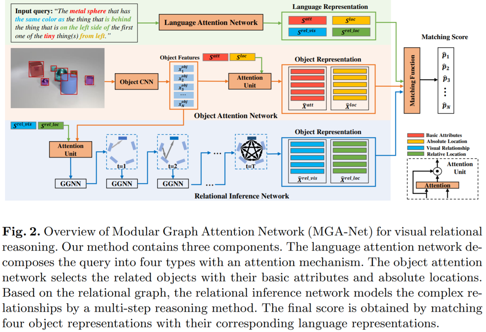

# MGA-Net

We provide PyTorch implementation for ["Modular Graph Attention Network for Complex
Visual Relational Reasoning"](https://openaccess.thecvf.com/content/ACCV2020/papers/Zheng_Modular_Graph_Attention_Network_for_Complex_Visual_Relational_Reasoning_ACCV_2020_paper.pdf). (ACCV2020) 

## Paper
* Modular Graph Attention Network for Complex
Visual Relational Reasoning
* Yihan Zheng *, Zhiquan Wen *, Mingkui Tan, Runhao Zeng, Qi Chen, Yaowei Wang * and Qi Wu
* Asian Conference on Computer Vision (ACCV), 2020
 

## Dependencies

* Python 3.6
* requirements.txt

## Getting Started

### Installation

1. Clone this repository:

        git clone https://github.com/wzq12345/MGA-Net.git
        cd MGA-Net
        export PYTHONPATH='./'

2. Install PyTorch and other dependencies:

        pip install -r requirements.txt

## Training

1. Download the features to the folder "data" from the releases.
   
        wget https://github.com/wzq12345/MGA-Net/releases/download/feature_v1/clevr_ref+_1.0.zip
        unzip -d ./data clevr_ref+_1.0.zip

2. Train the MGA-Net
   
        python train.py

## Pre-trained Model

 | Model |GGNN | Link| Acc (%)|
   | :-: | :-: | :-: | :-: |
 |MGA-Net| 0 |https://github.com/wzq12345/MGA-Net/releases/download/v1/GGNN_0.pth| 76.51|
 |MGA-Net| 3 |https://github.com/wzq12345/MGA-Net/releases/download/v1/GGNN_3.pth| 80.87|

## Citation
If this work is useful for your research, please cite our paper:

    @inproceedings{MGA-Net,
        author    = {Yihan Zheng and
                    Zhiquan Wen and
                    Mingkui Tan and
                    Runhao Zeng and
                    Qi Chen and
                    Yaowei Wang and
                    Qi Wu},
        title     = {Modular Graph Attention Network for Complex Visual Relational Reasoning},
        booktitle = {ACCV},
        pages     = {137--153},
        year      = {2020},
    }

 

## Acknowledgments
Part of code obtained from [MattNet](https://github.com/lichengunc/MAttNet) and [IEP](https://github.com/ccvl/iep-ref) codebases.